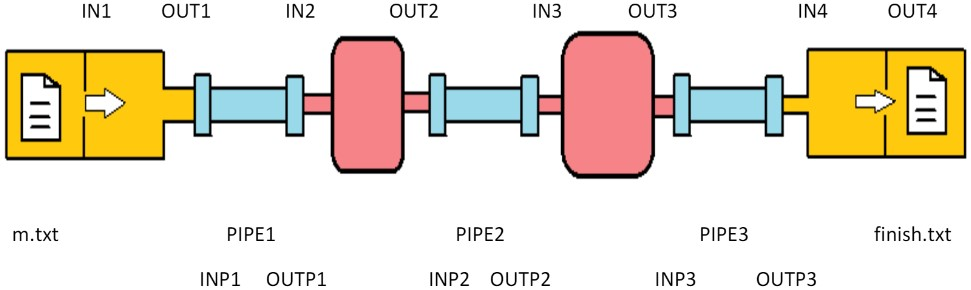

# _Eggshell_: A Linux Shell Written in C

The C programming language was used to develop a Linux shell. This project was a programming assignment for the [CPS1012: Operating Systems and Systems Programming 1](https://www.um.edu.mt/courses/studyunit/CPS1012) course, a course forming part of my B.Sc. in Computer Science.

# The _Eggshell_ Interpreter

_Eggshell_ is a command-line interpreter for the Linux OS. It was designed to cater for the following:

1. [**Shell Variables**](#shell-variables)
2. [**Internal and External Commands**](#internal-and-external-commands)
3. [**Input and Output Redirection**](#input-and-output-redirection)
4. [**Piping**](#piping)
5. [**Process Management**](#process-management)

These will be explained in the sub-sections to follow.

---

## Shell Variables

Shell variables are character strings to which a value is assigned. Shell variable names should be in UPPERCASE and can contain any of the following:

- letters ( **A-Z** )
- numbers ( **0-9** )
- underscores ( **\_** )

_Eggshell_ was designed to cater for these shell variables by default:

&emsp; `PATH` - The search path used to launch external commands

&emsp; `PROMPT` - The string presented to the user to show that the shell is ready to accept command input

&emsp; `CWD` - The path of the current working directory to which all file operations are relative to

&emsp; `USER` - The current user's username

&emsp; `HOME` - The current user's home directory

&emsp; `SHELL` - The current user's shell

&emsp; `TERMINAL` - The name of the terminal executing the current _Eggshell_ session

&emsp; `EXITCODE` - The exit code returned by the last program run by the shell

An ___assignment statement___ is used to modify existing shell variables or create new ones.

A shell variable's value is obtained by prefixing its name with a **$**. If a valid name is detected, the shell obtains its value from the list of shell variables.

    > NEW_VAR=#
    > print $NEW_VAR
    #
    > PROMPT=$NEW_VAR
    # print The prompt has been changed to: $PROMPT
    The prompt has been changed to: #

---

## Internal and External Commands

_Eggshell_'s command-line interpreter recognises a number of __internal__ (built-in) and __external__ commands.

When a new command is entered, it is compared to a list of built-in commands. If a command is not recognised as such, the shell treats the input as a call to an external command.

### Internal Commands

_Eggshell_ was designed to cater for the following internal commands:

&emsp; `exit` - Terminates all running processes spawned by the _Eggshell_ instance and quits the program

&emsp; `print` - Echoes text expressions or variable values to standard output

&emsp; `chdir` - Changes the current working directory (CWD)

&emsp; `all` - Prints all the shell variables in key-value pairs

&emsp; `source` - Provides scripting functionality. This command takes the name of a script file as its only argument and proceeds to open this file and execute all of its commands. Each executed command behaves exactly in the same way as if it were typed in

_Eggshell_'s current implementation traps and handles errors when commands fail. It returns appropriate error messages indicating the reason for failure.

### External Commands

The shell considers commands not included in the list above as external commands. It searches for matching program binaries through the system search path (PATH) and launches them as separate processes by forking.

---

## Input and Output Redirection

_Eggshell_ supports the following redirection operators:

&emsp; `>` - Redirects a command's output into a file

&emsp; `>>` - Redirects a command's output into a file, appending to the file's existing contents

&emsp; `<` - Uses a file's contents as input to a command

&emsp; `<<<` - Uses text as _here string_ input to a command

The usage of these commands is shown in the examples below, where _'cmd'_ denotes an arbitrary command (internal/external) with zero or more arguments and _'f.txt'_ refers to an arbitrary file.

    # cmd > f.txt
    # cmd >> f.txt
    # cmd < f.txt
    # cmd <<< 'text
    more text
    even more text'

---

## Piping

The Unix piping operator **'|'** was implemented to chain multiple processes by their input and output streams. This allows the output (stdout) of one process to feed directly into the input (stdin) of the next, and so forth.

As an example, consider the 4 command sequence below:

    cat m.txt | grep a | wc -l | figlet > finish.txt

The output of one command is passed as input to the next, as if the commands are connected together as one whole process. The diagram below helps to visualise this concept.

  
   
  The piping process for 4 commands

---

## Process Management

Shells reserve a keyboard shortcut (typically **`CTRL`** + **`C`**) to interrupt running processes. Given that _Eggshell_ is a process itself, this shortcut would also terminate the current _Eggshell_ instance.

To prevent this, the **SIG INT** signal triggered with this shortcut is trapped and forwarded to any process spawned by _Eggshell_, forcing this process only to exit, and not _Eggshell_ itself.

# Documentation

A detailed description of this project's deliverables can be found [here](https://github.com/tristan-oa/Linux-Shell-in-C/blob/master/Assignment_SPECIFICATION.pdf).

A detailed technical documentation of the source code written can be found [here](https://github.com/tristan-oa/Linux-Shell-in-C/blob/master/DOCUMENTATION.pdf).
